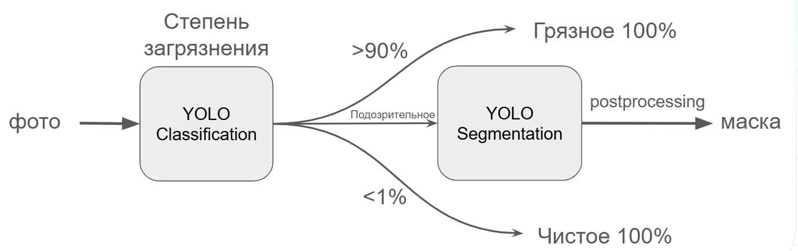

# Хаккатон Норникеля. Кейс "грязные дела"
# Продукт AntiGryaz
## Команда DeepSearchers

Данный проект выполнен в рамках хаккатона Норникеля кейса "грязные дела". Решение представляет собой алгоритм по определению загрезнений камеры. В дополнение, решение имеет UI интерфейс для интерактивного оценивания качества работы системы.

**Ссылка на тестовый стенд: http://176.99.135.125:8888 (уж очень мы хотели его сделать)**

## Алгоритм ИИ-ядра системы задачи



1. Изображение поступает на вход классификатору "грязности" YOLO-v11n, который делит все изображениия на 3 класса: >90% грязи (очень грязное), <1% грязи (очень чистое) и подозрительное
2. На изображениях, определенных как "подозрительные" сегментатор YOLO-v11n ищет маску загрязнения, на "очень грязных" изображениях за маску загрязнение принимаем весь кадр, а на "чистом" - маска сегментации нулевая
3. Для сегментированных изображений делаем opening-postprocessing, чтобы нивилировать воздействие шумовых артефактов


По ресерч части так же:

- Все скрипты обучения лежат в директории research.
- Весь код алгоритма имплементирован в core.py, его можно запустить в "2 клика" в demo.ipynb


## Требования по оборудованию:

- Минимальное требование ОЗУ: 8 гб

- Желательно наличие графического ускорителя нвидиа с минимальной VRAM 4 гб. Скорость работы на ЦПУ может быть ниже

## Запуск web-приложения для AB-тестирования

По вопросам, связанным с запуском можно писать в телеграм: [t.me@ankhafizov](https://t.me/ankhafizov).

1. Через docker (**рекомендуемый путь**):

```
docker-compose up -d
```

Сайт будет доступен по localhost:8888. Первая загрузка сайта может быть несколько долгой из-за "прогрева" нейросетей.

2. Через командную строку

Установите торч с гпу (например, pip3 install torch==2.0.1 torchvision==0.15.2). Подрбнее см https://pytorch.org/get-started/previous-versions/. Затем:

```
pip install -r requirements.py
streamlit run main_streamlit.py
```

В браузере соответствующее окно откроется автоматически.
